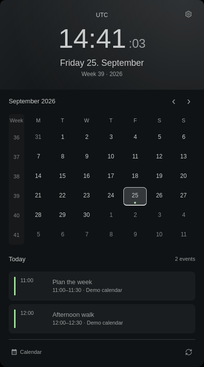

# Foamy Clock

A clock, month calendar, and calendar agenda.



## Install

For events, install GNOME Calendar (`gnome-calendar`) and select your calendars.

```sh
omarchy plugin add https://github.com/foamrider/foamy-clock.git --enable
```

## Use

- Left-click the clock to open the calendar. Select a day to see its events.
- Use the arrows to change month; click the header to return to today.
- Open the cog to change language, time format, and agenda settings.
- Right-click the bar clock to cycle formats. Middle-click opens the timezone picker.

The calendar shortcut opens GNOME Calendar by default; change it in settings.

## License

Licensed under [MIT](LICENSE), with [Omarchy](LICENSE-OMARCHY) and
[Lucide](LICENSE-LUCIDE) notices.

Provided **as is**, without warranty or guaranteed support. Use at your own risk.
