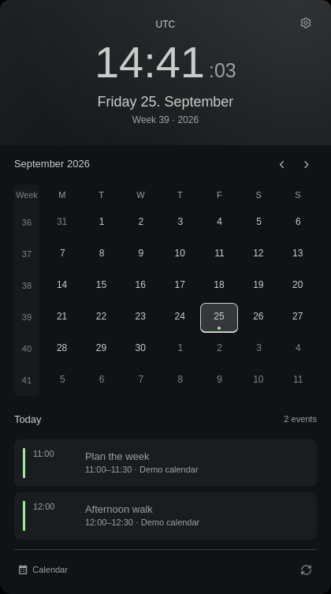

# Foamy Clock

A clock, month calendar, and calendar agenda.



## Install

Requires Omarchy Quattro and Python 3. Agenda access also uses
`python-gobject` and Evolution Data Server (`evolution-data-server`).

For events, install GNOME Calendar (`gnome-calendar`) and select your calendars.

```sh
omarchy plugin add https://github.com/foamrider/foamy-clock.git --enable
```

## Use

- Left-click the clock to open the calendar. Select a day to see its events.
- Use the arrows to change month; click the header to return to today.
- Open the cog to change language, time format, and agenda settings.
- Right-click the bar clock to cycle formats. Middle-click opens the timezone picker.

The calendar shortcut opens GNOME Calendar by default; change it in settings.

## Agenda behavior

The agenda loads the selected day first, followed by calendar markers for the
42 dates in the visible month grid. Recent views are cached automatically;
there is no month-cache setting. Fresh cached views are reused when navigating.
The refresh button always requests fresh data.

The footer shows **Partial update · open calendar** when a refresh is incomplete.
Click it, or the Calendar button, to open the full calendar app. Previously
complete cached events remain visible if a refresh fails. Empty partial results
do not mean that the day has no events.

To protect the desktop shell, the helper limits each day to 100 event summaries,
each overview to five calendar markers per date, and each query to 32 selected
calendars with two clients active at once. Each source has a 2,048-occurrence
processing budget. Long event titles, locations, and calendar names are shortened.
Limits or source failures produce an incomplete status; displayed event counts
then say how many events are shown.

Worker processes have a 512 MiB virtual-memory limit and a 45-second deadline.
The bridge accepts at most 256 KiB per response before forwarding it to the
shell. The private cache is limited to 1 MiB and 64 recently used views; older
views are evicted automatically. Cached views are available offline while
retained, but a complete three-month offline calendar is not guaranteed.

The cache lives at `$XDG_CACHE_HOME/foamy-clock/agenda-v2.json` (default:
`~/.cache/foamy-clock/agenda-v2.json`). The older `agenda-v1.json` cache is ignored
and can be removed. Calendar accounts and events remain managed by Evolution.

## Remove

```sh
omarchy plugin remove foamy.clock
```

When removing an enabled replacement, Omarchy restores `omarchy.clock`.
Calendar accounts, events, GNOME Calendar, and the agenda cache remain on disk.

Omarchy manages the plugin entry in `shell.json`. Packages and data outside
the plugin directory are retained unless you remove them separately.

## License

Licensed under [MIT](LICENSE), with [Omarchy](LICENSE-OMARCHY) and
[Lucide](LICENSE-LUCIDE) notices.

Provided **as is**, without warranty or guaranteed support. Use at your own risk.
